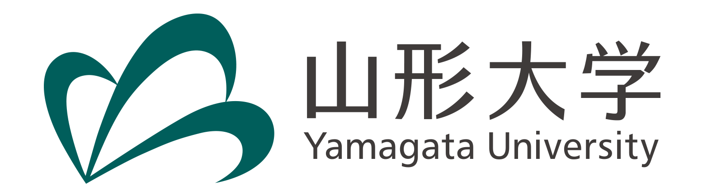

---

## Purpose

In 2014, LIGO confirmed the existance of gravitational waves. Since then, gravitational waves became a useful tool to explore the early universe and even fundamental physics. A variety of the ways to detect gravitational waves are on-going and proposed, covering vast range of the gravitational wave frequency bands.

One of the observable gravitational wave sources is a phase transition in the early universe, leading to bubbles and/or topological defects. Axion, one of the dark matter candidates, also predicts hybrid type topological defects. Therefore, now will be a high time to understand the basic properties of topological defects originating in the fundamental physics. Topological defects are also important in low energy physics such as superconducters. 

Our purpose of this workshop is to share and discuss recent progress and new ideas on frontiers in gravity and fundamental physics and
to trigger the interplay between fundamental physicists and cosmologists.

This workshop is basically on-site. We use zoom for invited talks if needed.

### Keywords

- Gravitational waves
- Topological defects
- Dark matter
- Axions

## Schedule

From xxth October, 2022 to xxth October, 2022

## For Speakers

Invited talks: 45min

Oral talks: 20min (15min + 5min)

[**Registration**](https://docs.google.com/forms/d/e/1FAIpQLScQ7cZczh49vsoBibnotlcjHMDr4zpHkij-wIlkZcfzcFgOag/viewform?usp=sf_link)

## Important Days

Registration Deadline: 10th September, 2022

Expected Program Issue Day: 30th September, 2022

## Invited Speakers

Minoru Eto (Yamagata University)

(Masato Arai (Yamagata University))

(Graham White (Kavli IPMU, University of Tokyo))

(Sachiko Kuroyanagi (Nagoya University))

(Toshifumi Noumi (Kobe University))

## [Program](program)

## [Participants](participants)

## [Venue](https://goo.gl/maps/SRyD9WjDTtY7XSceA)

Centennial Hall,
[Faculty of Engineering,
Yamagata University](https://www.yz.yamagata-u.ac.jp/en/), 
4-3-16, Jonan, Yonezawa, 992-8510, Yamagata

## Information

There is a hotel near the campus: [Yonezawa Excel Hotel Tokyu](https://www.tokyuhotels.co.jp/yonezawa-e/index.html).

(For foreginers) If you need any help on booking a room, please [contact us](https://docs.google.com/forms/d/e/1FAIpQLSe-WvHLB6pjCyKTq3vbE7N5C_1kKwo4OvinEA9pueLrgdbBWg/viewform?usp=sf_link).

We have no support grants for travel and accommodation fees for speakers. Sorry.

## Organaizers

Minoru Eto (Yamagata University)

Yuki Sakakihara (Yamagata University)

(Asuka Ito (Tokyo Institute of Technology))

(Kazufumi Takahashi (Kyoto University))

(Daisuke Yoshida (Nagoya University))

(Ryo Namba (Riken))

[Contact us](https://docs.google.com/forms/d/e/1FAIpQLSe-WvHLB6pjCyKTq3vbE7N5C_1kKwo4OvinEA9pueLrgdbBWg/viewform?usp=sf_link)

## Support

The venue and facilities are provided by Faculty of Engineearing, Yamagata University

