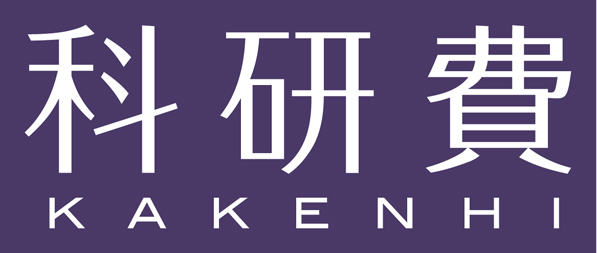

---

## Purpose

In 2016, LIGO confirmed the existence of gravitational waves. Since then, gravitational waves became a useful tool to explore the early universe and even fundamental physics. A variety of the ways to detect gravitational waves are on-going and proposed, covering vast range of the gravitational wave frequency bands.

One of the observable gravitational wave sources is a phase transition in the early universe, leading to bubbles and/or topological defects. Axion, one of the dark matter candidates, also predicts hybrid type topological defects. Therefore, now will be a high time to understand the basic properties of topological defects originating in the fundamental physics. Topological defects are also important in low energy physics such as superconducters. 

Our purpose of this workshop is to share and discuss recent progress and new ideas on frontiers in gravity and fundamental physics and
to trigger the interplay between fundamental physicists and cosmologists.

This workshop is basically on-site. We lively broadcast the workshop through Zoom for online participants.  
This year, the talks are given in Japanese.

### Keywords

- Gravitational waves
- Topological defects
- Dark matter
- Axions

## Invited Speakers

- Yu Hamada (KEK)

- Masahiro Ibe (ICRR, University of Tokyo)

- Asuka Ito (Tokyo Institute of Technology)

- Ryuichiro Kitano (KEK)

- Ryo Namba (RIKEN)

- Muneto Nitta (Keio University)

- Toshifumi Noumi (Kobe University)

- Ken'ichi Saikawa (Kanazawa University)

- Jiro Soda (Kobe University)

- Fuminobu Takahashi (Tohoku University)

- Kazuya Yonekura (Tohoku University)

## Student Speakers

- Takuya Takahashi (Kyoto University)

- Yuito Suzuki (Yamagata University)

- Ann Nakato (Kobe University)

## [Program](program)

## [Participants](participants)

## Registration

[**Registration**](https://docs.google.com/forms/d/e/1FAIpQLScQ7cZczh49vsoBibnotlcjHMDr4zpHkij-wIlkZcfzcFgOag/viewform?usp=sf_link)

## Schedule

From 26th November, 2022 to 27th November, 2022

We have invited sessions and a student session. No contributed talks.

## Important Days

Registration Deadline for on-site participants: 28th October, 2022

Registration Deadline for online participants: 18th November, 2022

## [Venue](https://goo.gl/maps/SRyD9WjDTtY7XSceA)

Centennial Hall,
[Faculty of Engineering,
Yamagata University](https://www.yz.yamagata-u.ac.jp/en/), 
4-3-16, Jonan, Yonezawa, 992-8510, Yamagata

- 8min from Yonezawa Station by taxi
   - Yonezawa Station (130min from Tokyo Station, 70min from Sendai Station by Shinkansen)

- 12min from Uesugi Jinja Mae Bus Stop on foot. 
    - Uesugi Jinja Mae Bus Stop (2 hours from Sendai Station by highway bus)

## Information

- Guest house in the campus: [Guest House YU (4MB pdf file)](guest_house_YU.pdf) (5min on foot from the venue) 
- Hotels: [Yonezawa Excel Hotel Tokyu](https://www.tokyuhotels.co.jp/yonezawa-e/index.html) (5min by taxi from the campus)

## Organizers

- Masato Arai (Yamagata University)

- Minoru Eto (Yamagata University)

- Yuki Sakakihara (Yamagata University)

- Kazufumi Takahashi (Yukawa Institute for Theoretical Physics, Kyoto University)

[Contact us](https://docs.google.com/forms/d/e/1FAIpQLSe-WvHLB6pjCyKTq3vbE7N5C_1kKwo4OvinEA9pueLrgdbBWg/viewform?usp=sf_link)

## Sponsors

This workshop is partly supported by 

- Grant-in-Aid for Scientific Research (C)
    - 21K03565 for Masato Arai (PI)
    - 19K03839 for Minoru Eto (PI)

- Grant-in-Aid for Scientific Research (B) 
    - 22H01221 for Minoru Eto (co-PI)

- Grant-in-Aid for Research Activity Start-up
    - 22K20365 for Yuki Sakakihara (PI)

- Council for the Promotion of Academic City by Yonezawa City

The venue and facilities are provided by Faculty of Engineearing, Yamagata University

 

