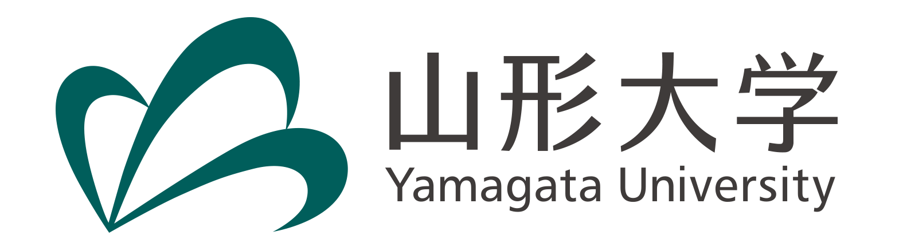

## Pupose

The universe has misteries to be understood: the origin of dark matter, baryon anti-baryon asymmetry, the smallness of the neutrino masses, etc. 
In 2014, LIGO confirmed the existance of gravitational waves throught the detection from binary black holes,
and gravitational waves became a useful tool to explore the early universe and even high energy physics. 
Our purpose of this workshop is to share and discuss recent progress on how to extract clue to misteries of the universe from gravitational waves.
To accomplish this purpose, we invite both experts and young physicists in this field.

### Keywords

- Gravitational waves
- Topological defects
- Dark matter
- Axions

## Schedule

From xxth October, 2022 to xxth October, 2022

## For Speakers

Invited talks: 45min

Oral talks: 20min (15min + 5min)

[**Registration**](https://docs.google.com/forms/d/e/1FAIpQLScQ7cZczh49vsoBibnotlcjHMDr4zpHkij-wIlkZcfzcFgOag/viewform?usp=sf_link)

## Important Days

Registration Deadline: 10th September, 2022

Expected Program Issue Day: 30th September, 2022

## Invited Speakers

(Ivette Fuentes (University of Southampton) Online invitaion)

(Elisa Ferreira (Max Planck Institute) Online invitation)

(Minoru Eto (Yamagata University))

(Sachiko Kuroyanagi (Nagoya University))

(Toshifumi Noumi (Kobe University))

## [Program](program.md)

## [Participants](participants.md)

## [Location](https://goo.gl/maps/SRyD9WjDTtY7XSceA)

[Faculty of Engineering,
Yamagata University](https://www.yz.yamagata-u.ac.jp/en/), 
4-3-16, Jonan, Yonezawa, 992-8510, Yamagata

## Information

There is a hotel near the campus: [Yonezawa Excel Hotel Tokyu](https://www.tokyuhotels.co.jp/yonezawa-e/index.html).

If you need any help on booking a room, please contact us.

We have no support grants for travel and accomordation fees for speakers. Sorry.

```


```

## Organaizers
Yuki Sakakihara (Yamagata University)

(Asuka Ito (Tokyo Institute of Technology))

(Kazufumi Takahashi (Kyoto University))

(Daisuke Yoshida (Nagoya University))

(Graham White (Kavli IPMU, University of Tokyo))


## Support

The venue and facilities are provided by Faculty of Engineearing, Yamagata University



